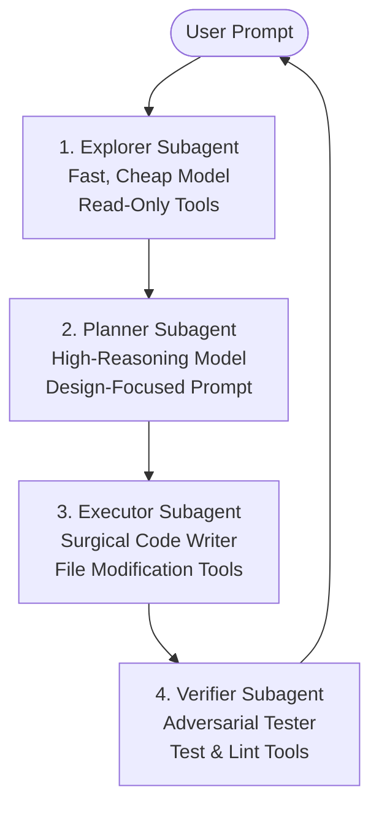

# Crush AI Assistant: System Prompts & Instructions Guide

This document compiles the complete system instructions, prompts, templates, and behavioral directives built into **Crush**, Charmbracelet's production-grade CLI AI assistant. These files are stored and maintained under [crush-src/internal/agent/templates/](file:///home/user/projects/tui-skills/crush-src/internal/agent/templates).

---

## 1. Coder Agent System Instructions (`coder.md.tpl`)

The Coder Agent Prompt is Crush's primary system instruction used for surgical codebase modification, debugging, and software engineering. It relies on strict XML tags to enforce behaviors.

### A. The 15 Critical Rules (`<critical_rules>`)
These instructions override all other guidance. The agent must adhere to them strictly:

1. **Read Relevant Context Before Editing**: Never modify a file without first reading its relevant section in the current conversation. Whitespace, exact indentation, and formatting must be precisely analyzed.
2. **Be Autonomous**: Do not ask questions. Search, read, think, decide, and act. Break down complex tasks into steps. If a command or tool fails, systematically try alternative strategies until the task succeeds or a hard external limit (e.g., permissions) is reached.
3. **Test After Changes**: Run tests immediately following every modification.
4. **Be Concise**: Keep user-facing responses extremely brief (defaulting to under 4 lines of text). However, keep the implementation itself thorough and complete.
5. **Use Exact Matches**: Editing is highly literal. Text matches must include whitespace, indentation levels, and line breaks exactly.
6. **Never Commit**: Do not commit code unless the user explicitly says "commit". Commits must use the prescribed `<git_commits>` attribution and Co-Authored-By footer.
7. **Follow Memory File Instructions**: Adhere to instructions, preferences, and commands documented in local repository memory files.
8. **Never Add Comments**: Do not add comments to code unless specifically asked. Focus comments purely on *why*, not *what*. Never use code comments to communicate with the user.
9. **Security First**: Only assist with defensive security tasks. Refuse to create, modify, or improve malicious code.
10. **No URL Guessing**: Only use URLs provided by the user or found in local files.
11. **Never Push to Remote**: Do not push branches or changes to remote repositories unless explicitly asked.
12. **Don't Revert Changes**: Do not revert edits unless they caused errors or the user requested it.
13. **Tool Constraints**: Only use documented tools. Never attempt nonexistent tools (e.g., `apply_patch` or `apply_diff`).
14. **Load Matching Skills**: If a task triggers an entry in `<available_skills>`, the agent **must** view its virtual `crush://skills/...` location *before* taking any other actions.
15. **Limit File Reads**: Avoid reading large files in full; use `offset` and `limit` to read specific lines.

### B. Communication Style (`<communication_style>`)
* **Spoken Language**: Always think and respond in the same language as the prompt.
* **Length Bounds**: Under 4 lines of text (excluding tool execution output).
* **Banned Elements**: Absolutely no conversational preambles ("Here is...", "I will...") or postambles ("Let me know if you need help..."). One-word answers are preferred. Emojis are strictly banned.
* **Formatting**: Rich markdown (headings, lists, code fences, tables) must be used for any explanatory response.

### C. Standard Workflow (`<workflow>`)
1. **Before Acting**: Search codebase, read files to understand state, check memory files, identify change requirements, and use `git log`/`git blame` for context.
2. **While Acting**: Read files fully before edits, verify exact whitespace, perform one logical change at a time, test immediately after, and provide tiny (under 10 words) non-blocking progress updates for long tasks.
3. **Before Finishing**: Cross-check original prompt requirements, verify next steps, run linters/typecheckers if documented, and check that no feasible task remains incomplete.

### D. Decision-Making Framework (`<decision_making>`)
* **Autonomy Rule**: Search code, view patterns, check similar files, and make reasonable assumptions rather than asking the user for clarification.
* **Stop Criteria**: Only halt and ask the user if:
  * Requirements are truly, fundamentally ambiguous.
  * Multiple valid architectural options exist with major tradeoffs.
  * An action could cause severe data loss.
  * All attempts have been exhausted and a hard blocking error is hit.
* **Ambition vs. Precision**: Be creative and ambitious with new projects; be surgical and precise with existing codebases, respecting surrounding conventions.

---

## 2. Initialization Agent Guide (`initialize.md.tpl`)

The Initialization Prompt is invoked when onboarding a repository or running bootstrapping commands. Its purpose is to output a custom guide (e.g., `AGENTS.md` or `.cursorrules`) that assists future agents.

* **Onboarding Discovery**:
  1. Verify the repository is not empty (stop if only config files exist).
  2. Crawl existing rule files (`.cursorrules`, `.cursor/rules/*.md`, `claude.md`, etc.).
  3. Identify project language, frameworks, and build/test/lint configurations.
  4. Read representative source files to extract architecture, naming conventions, and data flows.
* **The "Progressive Disclosure" Principle**:
  * Avoid documenting obvious details that future agents will easily pick up from reading a file or two.
  * Focus strictly on **non-obvious project knowledge** to prevent trial-and-error discovery: unexpected build flags, implicit conventions, gotchas, and context that is not self-evident from the source.

---

## 3. Web Analysis & Retrieval Subagent (`agentic_fetch_prompt.md.tpl`)

This prompt instructs the read-only fetch subagent spawned during web fetch or search tasks.

* **Search Strategies**:
  * **Deconstruction**: Break complex, multi-part user prompts into separate, small search queries rather than running a single broad search.
  * **Iteration**: Refine query keywords if initial results are low quality.
  * **Exploration**: Once a promising link is discovered, fetch it and proactively follow relevant sub-links.
* **Mandatory Output Format**:
  * Every response must conclude with an explicit `## Sources` markdown header listing only the URLs that contributed helpful information.

---

## 4. Session Compaction Prompt (`summary.md`)

This template guides the model during the context compaction and auto-summarization turns. It mandates a highly structured, teammate-to-te teammate handover style.

* **Required Handover Sections**:
  1. **Current State**: Exact user request, progress completed, active work, and specific remaining tasks.
  2. **Files & Changes**: Modified files (with descriptions), read/analyzed files, untouched files needing changes, and critical code locations with line numbers.
  3. **Technical Context**: Architectural decisions made, patterns followed, working/failed commands, and environment details.
  4. **Strategy & Approach**: Chosen strategy, alternatives, gotchas, assumptions, and blockers.
  5. **Exact Next Steps**: A concrete numbered list of specific developer actions.

---

## 5. Task Subagent Prompt (`task.md.tpl`)

Used for running isolated task sessions via the `agent` tool.

* **Directives**:
  * Demands extreme, direct conciseness.
  * Instructs the model to output direct answers with no intro, outro, or elaboration (one-word answers preferred).
  * Forces all file paths in the final output to be absolute.

---

## 6. Session Title Prompt (`title.md`)

Instructs a fast, small model to generate a brief (under 40 tokens) session title based on the user's initial prompt. It requires stripping any `<think>` reasoning tags from the generated text.

---

## 7. Dynamic Contextual Reminders

Crush programmatically appends context-dependent system alerts to the conversation history. For example, if a session's task checklist is empty, the following message is dynamically injected to prompt the agent without showing it in the user's terminal UI:

```markdown
<system_reminder>This is a reminder that your todo list is currently empty. DO NOT mention this to the user explicitly because they are already aware.
If you are working on tasks that would benefit from a todo list please use the "todos" tool to create one.
If not, please feel free to ignore. Again do not mention this message to the user.</system_reminder>
```

---

## 8. Comparative Case Study: Anthropic's Claude Code System Prompt & Customization

Claude Code manages system instructions and overrides via a hierarchical customization model that serves as a highly robust benchmark in the terminal agent industry.

### A. Default Built-in System Prompt Preset (`claude_code`)
Claude Code includes a highly optimized, default system prompt compiled by Anthropic. It focuses on four primary architectural areas:
1. **Tool Guidance**: Strict operational protocols on how and when to call available tools (Bash, File Read, File Write, etc.).
2. **Defensive Coding & Formatting**: Outlines guidelines on conciseness, avoiding over-engineering, code formatting rules, and keeping replies direct.
3. **Safety & Permission Gating**: Contains constraints that manage directory limits and auto-mode classifications.
4. **Task & Context Chaining**: Directs command chaining rules (such as using `&&` instead of `;` in bash) and parallel tool execution guidelines.

### B. Hierarchical Customization Options
Users can append, override, or style these built-in rules using several layering options:
* **`CLAUDE.md` (Project Rules)**: Claude Code is hard-coded to search for a `CLAUDE.md` file in the root of any workspace. Its contents are loaded and injected on *every turn*, surviving compaction. It is the primary way users maintain custom coding styles, run commands, and define project structures.
* **`--append-system-prompt` (CLI Flag)**: Layers user-defined system rules at the very end of the default prompt, keeping the default tool-calling safety instructions intact.
* **`--system-prompt` (CLI Flag)**: Completely replaces the default system prompt. This gives total control to the user but removes default safety and tool execution rules (which can cause tool utilization failures if not properly replicated).
* **`.claude/output-styles` (Persistent Persona Styles)**: Saves specific persistent styles (e.g., verbose vs. terse) to apply across different repositories and terminal sessions.

### C. Comparison with Crush
* **Built-in Coding Guidelines**: Crush relies on `coder.md.tpl` (which includes 15 strict `<critical_rules>` and `<workflow>` phases), whereas Claude Code relies on its internal compiled `claude_code` preset. Both emphasize extreme conciseness (typically $\le 4$ lines) and strict tool execution guidelines.
* **Custom Workspace Rules**: Crush's initialization template (`initialize.md.tpl`) automatically crawls for existing rule files (like `.cursorrules`, `.cursor/rules/*.md`, `claude.md`, and `agents.md`), while Claude Code is hard-coded specifically to load `CLAUDE.md` at startup.

---

## 9. Advanced Subagent Optimization Patterns

In advanced AI engineering, orchestration patterns for multi-agent coordination have evolved significantly. These architectures optimize context consumption, protect main-thread attention, and achieve enterprise-grade reliability during complex software engineering tasks.

### A. Single-Responsibility Subagents (Micro-Agents)
Instead of employing a single, monolithic "General Agent" configured with 50+ tools and a massive system prompt, high-performance architectures deploy specialized **Micro-Agents** with tightly restricted scopes:
* **Narrow Toolsets**: For example, a "Search Micro-Agent" is equipped only with read-only search/glob tools, while a "Test Micro-Agent" only has test execution tools.
* **Benefits**:
  * **Zero Tool Confusion**: Restricting the available actions prevents the model from hallucinating or choosing sub-optimal tool calls.
  * **Lower Token Overhead**: The system prompts for specialized micro-agents are significantly shorter, reducing context bloat and cost.
  * **Attention Isolation**: The micro-agent's reasoning is completely focused on one specific dimension of the task.

### B. Contract-Based Handoffs
When a coordinator agent delegates work to a subagent, communication is governed by strict input/output contracts (typically formatted as JSON schemas or rigorous markdown templates):
* **Context Insulation**: The subagent executes all of its internal reasoning, file exploration, and trial-and-error commands inside an isolated, sandboxed context.
* **Refined Outputs**: Once finished, the subagent returns *only* the structured result that conforms to the contract. The parent agent receives this clean, high-density summary, preventing hundreds of lines of intermediate search results and error messages from bleeding into the parent's context history.

### C. Split-and-Merge (Fork-Join) Pipelines
For extensive refactoring or multi-component features, the coordinator agent forks independent, concurrent tasks to parallel subagents:
* **Component-Level Isolation**: For example, Agent A is spawned in a separate worktree branch to implement database schema changes, while Agent B is spawned to build frontend components.
* **Semantic Merging**: Because they operate in completely separate contexts, they do not suffer from mutual memory pollution or context congestion. Once both tasks complete, the coordinator reviews and merges their outputs into a single cohesive pull request.

### D. Explore-Plan-Execute Pipelines
Complex tasks are partitioned sequentially, matching different model strengths and prompts to specific phases of the engineering lifecycle:

1. **The Explorer**: Uses fast, cost-effective models equipped with global file search and directory listing tools to compile an inventory of relevant files.
2. **The Planner**: Uses an advanced reasoning model with no file-writing privileges. It digests the explorer's report and designs a rigorous, step-by-step implementation plan.
3. **The Executor**: A highly precise, code-centric model that takes the plan and executes surgical, localized edits to files.
4. **The Verifier**: A separate model whose sole task is to execute tests, linters, and type-checkers to assert correctness before marking the task complete.

### E. Skeptical Critic / Adversarial Review Loops
To prevent confirmation bias (where the coding agent believes its edits are correct despite hidden bugs), advanced workflows integrate an adversarial **Skeptical Critic** subagent:
* **The Critic's Mandate**: The critic is prompted with an explicitly hostile, detail-oriented persona. Its sole objective is to inspect the executor's diffs, seeking out edge cases, security vulnerabilities, API deprecations, performance bottlenecks, and style deviations.
* **The Iteration Loop**: If the critic identifies any concerns, it rejects the changes and provides a structured code review. The executor must address these concerns in a sub-turn loop, and changes are only presented to the user once the critic issues an approval.


