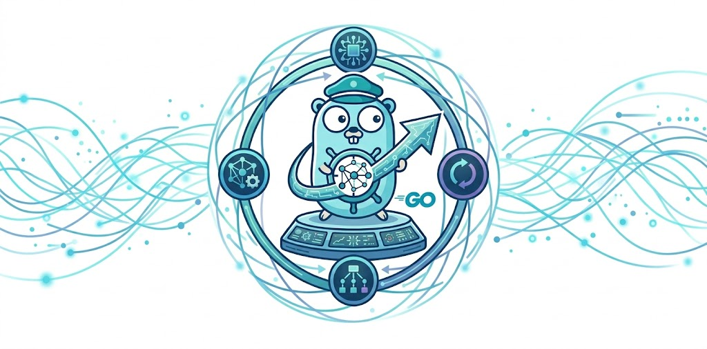

<div class="text-center pt-5">
  
</div>

<div class="text-center pt-4 pb-2">
  <p class="lead">
  A reusable Go-based agent built on the Google Agent Development Kit. Embed it in your binary, pick the providers and tools you need, ship.
  </p>
</div>

<div class="text-center pb-5">
  <a class="btn btn-lg btn-primary me-3 mb-4" href="docs/">Read the docs <i class="fa-solid fa-arrow-right ms-2"></i></a>
  <a class="btn btn-lg btn-secondary me-3 mb-4" href="https://github.com/go-steer/core-agent">Source on GitHub <i class="fa-brands fa-github ms-2"></i></a>
</div>

{}

`core-agent` ships first-class **Gemini** and **Claude** (first-party + Vertex) backends, **MCP** server integration, Claude-style **skills**, an **autonomous-run driver** with budgets + crash-resume, **durable sessions** with audit/replay event log, in-process and remote **subagents**, a **permission gate** with plan-first enforcement, an in-process Bubble Tea **TUI** plus a **remote TUI client** (`core-agent-tui`), a **multi-session daemon** with per-caller ACLs, and a **Kubernetes event-triage sidecar** — all behind a small Option-pattern API designed to be embedded in your own Go program.

{}

{}

{}
`agent.RunAutonomous` loops the model toward a goal with budgets (turns / tokens / cost / wallclock). `ResumeAutonomous` picks up after a crash from the durable event log.
{}

{}
`eventlog.Open` returns a SQLite/Postgres/MySQL-backed `session.Service` plus a `Stream` with monotonic `seq`, `Since(seq)` replay, and `Watch(seq)` live tail.
{}

{}
`agent.WithSubagents([]*Agent)` registers each as a callable tool. Subagent events stream into the parent's audit log under a branch-scoped path.
{}

{}
`core-agent-tui` attaches to any daemon over HTTP + SSE. One daemon serves many concurrent sessions with per-caller ACLs, per-session gates, and transparent resume across restarts.
{}

{}

{}

## Install

```bash
go get github.com/go-steer/core-agent@latest
```

See [Getting started](docs/getting-started/) for the first turn, or jump to [Library API](docs/library/api/) if you want the full surface.

{}
